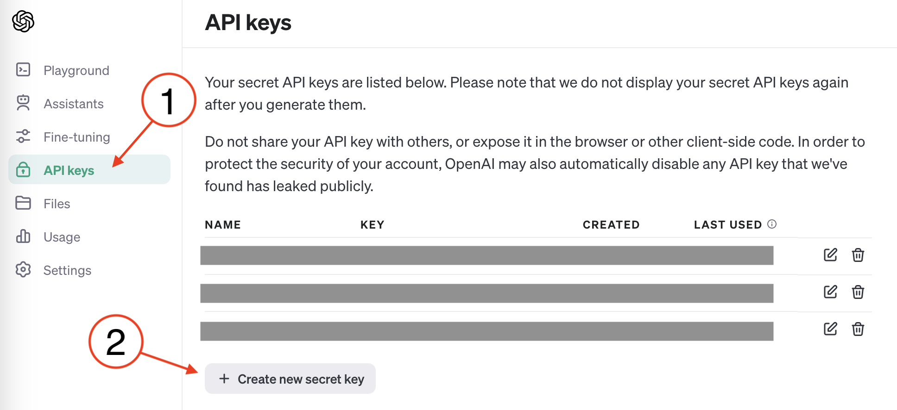
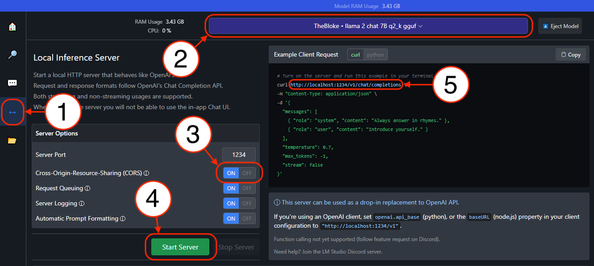

# LIT Prompts

LIT Prompts is a browser extension that generates LLM prompts based on user-authored templates. It is a project of Suffolk University Law School's [Legal Innovation & Technology (LIT) Lab](https://suffolklitlab.org/). It was designed to help students explore [prompt engineering](https://suffolklitlab.org/). Users can create and save prompt templates for use within the extension. These templates can use data from your active browser window (e.g., selected text or the whole text of a webpage) as well as text input provided by you. They can also feed into each other, allowing one to create complex interactions. 

# OpenAI-Compatible API Integration

To run your interactions, you'll need to point to the [API](https://en.wikipedia.org/wiki/API) for a [Large Language Model](https://en.wikipedia.org/wiki/Large_language_model) (LLM). You can use an OpenAI endpoint/base (i.e., `https://api.openai.com/v1/chat/completions`) along with an OpenAI API key _**OR you can use ANY endpoint that makes use of the same format!**_ For example, you could download something like [LM Studio](), spin up a local LLM, and point this extension at `localhost` (keeping your data on your computer). Alternatively, you could use a tool like [vLLM](https://docs.vllm.ai/en/latest/index.html) to spin up an OpenAI-compatible API server and point at that. 

## Using OpenAI with LIT Prompts

Login to [OpenAI](https://openai.com/), and navigate to the [API documentation](https://platform.openai.com/docs/). Note: when you create a new account you are given a limited API credit. If you created an account some time ago these may have expired. If your credits have expired, you will need to enter a [billing method](https://platform.openai.com/account/billing/overview) before you can use the API. 



1. Select "API keys" from the left menu
2. Click "+ Create new secret key"

On LIT Prompt's _Templates and Settings_ screen, set your API Base to `https://api.openai.com/v1/chat/completions` and your API Key equal to the value you got above after clicking "+ Create new secret key".

## Using LM Studio with LIT Prompts



After openig [LM Studio](https://lmstudio.ai/) and downloading a model/models. 

1. Select the "Local Inference Server" screen
2. Select your model
3. Make sure that _Cross-Origin-Resource-Sharing_ is on
4. Start your server
5. Copy the url for your server and use that as your API Base on LIT Prompt's _Templates and Settings_ screen (you can leave the API Key blank) 

# Export Interactions to HTML

You can export runnable versions of your interactions to one of two HTML output types: (1) a page that replicates this extension's "popup," the window with buttons that appears when you click the extension; or (2) a page that replicates both the "popup" and the "Scratch Pad." See the extention's _Templates & Settings_ screen for details. 

# Prompt Templates

When crafting a template, use a mix of plain language and variable placeholders. Specificlly, you can use double curly brackets to encase predefined variables and prompts for your user. If the text between the brackets matches one of our predefined variables, that section of text will be replaced with its content. For example, `{{highlighted}}` will be replaced by any selected/highlighted text on your current page, `{{innerText}}` will be replaced by the [innerText](https://developer.mozilla.org/en-US/docs/Web/API/HTMLElement/innerText) of your current page (roughly speaking the hard-coded text of a page), and `{{scratch}}` will be replaced with the contents of your Scratch Pad. If the text within brackets is not a predefined variable, like  `{{What is your name?}}`, it will trigger a user prompt for your user that echo's its content (e.g., they will see a text bubble containing, "What is your name?"). After the user answers, their reply will replace this placeholder (i.e., `{{What is your name?}}`). A list of predefined variables can be found in the sample templates: [Variables "random outcomes" and "time"](#variables-random-outcomes-and-time) and [Variables "from this page"](#variables-from-this-page). 

Use the inputs after a template's name and body to set parameters. If you use the _Post-run Behavior_ to send one template's output to another template, the first templat's output can be read by the second template via the `{{passThrough}}` variable. If this value is valid JSON, you can access individual elements by calling specific keys (e.g., `{{passThrough["key name"]}}`. When using the "DYNAMIC" setting for _Post-run Behavior_ the prompt found in `{{passThrough["next"]}}` will be triggered.

For a crash course on how everything fits together, you can read through this set of [sample templates](#sample-tempaltes) below in order. For more detail, read the next section [Prompt Execution](#prompt-execution).

Note: You can explore and contribute to our [library of templates](templates) (pre-written template files you can upload here).

## Prompt Execution 

TK

## Trust and Safety

TK

## Sample Tempaltes

When reading through templates, you may see comments between `[#` and `#]`. Such comments do not appear in the final prompts and are there to provide notes to template authors, like you. ;)

### Summarize & question this page
```
{{innerText}} [# FYI, the innerText variable will be replaced with the text from the current active browser tab, and because the Post-run Behavior is set to CHAT, you will be able to continue engaging with this text after the first reply. #]
  
Provide a short 150 word summary of the above text. If asked any follow-up questions, use the above text, and ONLY the above text, to answer them. If you can't find an answer in the above text, politely decline to answer explaining that you can't find the information. You can, however, finish a thought you started above if asked to continue, but don't write anything that isn't supported by the above text. And keep all of your replies short! 

```
Output Type: `LLM`,  Model: `gpt-3.5-turbo-16k`,  Temperature: `0`,  Max Tokens: `250`,  JSON: `No`,  Output To `Screen only`,  Post-run Behavior: `CHAT`,  Hide Button: `unchecked`  

### Politely decline an email (selected text)
```
{{highlighted}} [# FYI, the highlighted variable will be replaced with any text you have highlighted/selected when you click the extension's popup, and because Output To is set to Screen + clipboard, the LLMs output will be ready to paste in an email after the interaction runs. #]

The above is an email. Draft a brief and professional reply politely declining its request. 

```
Output Type: `LLM`,  Model: `gpt-3.5-turbo-16k`,  Temperature: `0.7`,  Max Tokens: `250`,  JSON: `No`,  Output To `Screen + clipboard`,  Post-run Behavior: `FULL STOP`,  Hide Button: `unchecked`  

### Define selected word/phrase
```
Define the following word/phrase: 

{{highlighted}}

Follow your definition with two carriage returns. [# Here we've set the Output To equal to Screen + append to scratch pad which means that the LLM's output will be appended to the contents of your Scratch Pad, which can be accessed from the Popup by clicking the "Scratch Pad" button. We assuming you'll be looking up more than one thing. So to make sure subsequent definitions don't all show up on one line, we've asked the LLM to add two carriage returns after each definition. #]

```
Output Type: `LLM`,  Model: `gpt-3.5-turbo`,  Temperature: `0`,  Max Tokens: `250`,  JSON: `No`,  Output To `Screen + append to scratch pad`,  Post-run Behavior: `FULL STOP`,  Hide Button: `unchecked`  

### Save Scratch Pad to file
```
{{scratch}} [# The scratch variable will be replaced with the content of your Scratch Pad, which can be accessed from the Popup by clicking the "Scratch Pad" button. Since we have set the Output Type to Prompt, this prompt will not be sent to an LLM, but having set Post-run Behavior to SAVE TO FILE, it will trigger your browser's save to file action. #]
```
Output Type: `Prompt`,  Model: `n/a`,  Temperature: `n/a`,  Max Tokens: `n/a`,  JSON: `No`,  Output To `Screen only`,  Post-run Behavior: `SAVE TO FILE`,  Hide Button: `unchecked`  

### Summarize & question Scratch Pad
```
{{scratch}} [# This template is just the "Summarize & question this page" template with the scratch variable in the place of innerText. Why? Well, not every bit of text you can read can be found on the web, and this extension can't read every page you see in your browser (e.g., PDFs). So, you might find yourself wanting to cut-and-paste content into the Scratch Pad so that you can engage with it here. #]
  
Provide a short 150 word summary of the above text. If asked any follow-up questions, use the above text, and ONLY the above text, to answer them. If you can't find an answer in the above text, politely decline to answer explaining that you can't find the information. You can, however, finish a thought you started above if asked to continue, but don't write anything that isn't supported by the above text. And keep all of your replies short! 

```
Output Type: `LLM`,  Model: `gpt-3.5-turbo-16k`,  Temperature: `0`,  Max Tokens: `250`,  JSON: `No`,  Output To `Screen only`,  Post-run Behavior: `CHAT`,  Hide Button: `unchecked`  

### "Diagram" selected sentence
```
[# This template is here mostly to show off the JSON parameter (I'm not sure how much I really trust it). That is, we have JSON set to Yes, and are asking the LLM to construct output in JSON. Consequently, the LLM should produce well-structured JSON output. If you haven't seen JSON before, you might want to read up on it here: https://en.wikipedia.org/wiki/JSON. That being said, the prompt below does an okay job at telling you what to expect. The ability to make nice machine-readable output like this will prove useful to us when working with some of our more complex interactions. FWIW, I had ChatGPT create the specifications below. #]Below I will provide you with a string of text. Your job is to produce a JSON representation of its sentence structure. 

1. Representation and JSON Structure:

The JSON representation of sentence structure consists of the following key-value pairs:

a) "subject": This key represents the subject of the sentence and contains an object describing the subject. The subject object can include properties such as "type" (to specify the type of subject, e.g., noun or pronoun) and "value" (to store the actual subject word or phrase).

b) "predicate": This key represents the predicate of the sentence and contains an object describing the predicate. The predicate object can include properties such as "type" (to specify the type of predicate, e.g., verb or verb phrase) and "value" (to store the actual predicate word or phrase).

c) "object": This key represents the object of the sentence and contains an object describing the object. The object object can include properties such as "type" (to specify the type of object, e.g., noun or pronoun) and "value" (to store the actual object word or phrase).

d) "complement": This key represents the complement of the sentence and contains an object describing the complement. The complement object can include properties such as "type" (to specify the type of complement, e.g., adjective or noun phrase) and "value" (to store the actual complement word or phrase).

e) "modifiers": This key represents any modifiers or additional information associated with the sentence. It contains an array of objects, where each object describes a specific modifier. Each modifier object can include properties such as "type" (to specify the type of modifier, e.g., adverbial or prepositional phrase) and "value" (to store the actual modifier word or phrase).

2. Example JSON Structure:

{
  "subject": {
    "type": "noun",
    "value": "cat"
  },
  "predicate": {
    "type": "verb",
    "value": "jumped"
  },
  "object": {
    "type": "noun",
    "value": "fence"
  },
  "complement": {
    "type": "adjective",
    "value": "high"
  },
  "modifiers": [
    {
      "type": "adverbial",
      "value": "quickly"
    },
    {
      "type": "prepositional phrase",
      "value": "over the wall"
    }
  ]
}

In this example, the JSON structure represents a sentence where the subject is "cat," the predicate is "jumped," the object is "fence," the complement is "high," and there are two modifiers: "quickly" (an adverbial modifier) and "over the wall" (a prepositional phrase modifier). 

3. Conclusion:
The JSON representation of sentence structure provides a standardized way to describe sentence elements such as subject, predicate, object, complement, and modifiers. It allows for the structured representation of sentence components, making it easier to process and analyze sentence structures programmatically.

Now that I've given you these specifications, your job is to make such an object for the following text string:

{{highlighted}}

Now provide your JSON object:
```
Output Type: `LLM`,  Model: `gpt-3.5-turbo`,  Temperature: `0`,  Max Tokens: `300`,  JSON: `Yes`,  Output To `Screen only`,  Post-run Behavior: `FULL STOP`,  Hide Button: `unchecked`  

### Translate & reply in original language
```
[# This template's "big trick" is that the Post-run Behavior is set to "display translation and prompt," which is the name of another template. This means that after this prompt is run through an LLM, it will trigger "display translation and prompt," and pass to it this template's output. Because the Output To is set to Hidden, however, the user will not see this structured data. #]You are helping translate text into English. Here is the text you are to work with:

{{highlighted}}
 
Return a JSON object with two key-value pairs. The first key is called `language`, and its value is the language of the above text. The second key is called `translation`, and its value is the above text translated into English. 

Now return the object: 

```
Output Type: `LLM`,  Model: `gpt-3.5-turbo-16k`,  Temperature: `0`,  Max Tokens: `250`,  JSON: `Yes`,  Output To `Hidden`,  Post-run Behavior: `display translation and prompt`,  Hide Button: `unchecked`  

### display translation and prompt
```
Translate the following text into {{passThrough["language"]}}. Here's the text to translate: 

{{{{passThrough["translation"]}}}} [# If you're familiar with JSON, you'll recognize that the two variables above are accessing the values stored in some JSON object named passThrough. Namely, the value for "language" and "translation." In this way we can very cleanly slice up the output from the prior template. Because the Hide Button checkbox is checked, the user will not see a button for "display translation and prompt." That of course is okay, because it is being triggered by "Translate & reply in original language." #]

```
Output Type: `LLM`,  Model: `gpt-3.5-turbo`,  Temperature: `0`,  Max Tokens: `250`,  JSON: `No`,  Output To `Screen + clipboard`,  Post-run Behavior: `FULL STOP`,  Hide Button: `checked`  

### Coin flip to poem
```
I'm going to flip a coin. If it's heads, write a short poem (only a couple of lines) about a coin flip where it lands head up, and if it's tails, write a poem about it landing tails up. Be very clear about the result of the coin flip in the poem. 

Coin flip: {{coinFlip}} [# The value of {{coinFlip}} is random, or as "random." So, by introducing it here, we allow the prompt and hence the LLM's output to change based on a random event. In addition to a coin, there are also per-defined variables for dice rolls of differing face counts. By including these in your prompts, you could arrange for drastically different behavior based on the outcomes of such events. Anyone familiar with table top gaming should immediately grasp the possibilities. #]

Now give me your response/poem: 

```
Output Type: `LLM`,  Model: `gpt-3.5-turbo`,  Temperature: `0.9`,  Max Tokens: `250`,  JSON: `No`,  Output To `Screen only`,  Post-run Behavior: `FULL STOP`,  Hide Button: `unchecked`  


### Shorten selected text
```
You're a helpful editor and you're going to help trim some text. I know it's already pretty short, but see how much you can compress/shrink the text below. When you rewrite it, knock off at least 20% of the length, but keep the main points: 

{{highlighted}}

```
Output Type: `LLM`,  Model: `gpt-3.5-turbo`,  Temperature: `0.7`,  Max Tokens: `250`,  JSON: `No`,  Output To `Screen + clipboard`,  Post-run Behavior: `FULL STOP`,  Hide Button: `unchecked`  

### Expand selected (short) text
```
[# This template is the first in a chain of templates that can either end or loop back on itself. It works by getting the LLM to generate some dialog and send that along with text the user has highlighted to another template. That template takes an action and feeds into another template, and so on and so on. Note: we're using gpt-3.5-turbo-1106 as a model here and in some of the subsequent templates in this chain. When this model is retired it will break things and require updating. #]You are an actor playing the role of a helpful writing assistant. In this scene you will interact with a writer. You will ask them some questions about some copy they are working on. You're goal is to ask them enough question such that their answers can be used to expand on the existing text. That is, you want them to give you things one could use to expand on the existing text. As this is a dialogue, we will present it in the form of a transcript. The writer will start by reading what they have so far. 

WRITER: {{highlighted}}

Think about how your character would respond and craft an appropriate reply. You will provide the text of this reply along with one other piece of information as a JSON object. The object will have two key-value pairs. The first key-value pair's key is "transcript" and the value is that of the transcript above, starting with "WRITER:" and followed by the text of their copy. Be sure to escape an quotation marks. The second key-value pair has a key called "reply" and its value is the response you crafted above (i.e., it is the text of your character's reply to the above, your first question for the writer). Include only the text of your reply (e.g., do NOT preface the text with the name of the speaker).

```
Output Type: `LLM`,  Model: `gpt-3.5-turbo-1106`,  Temperature: `0.7`,  Max Tokens: `250`,  JSON: `Yes`,  Output To `Hidden`,  Post-run Behavior: `Role Play 1`,  Hide Button: `unchecked`  

### Role Play 1
```
{{passThrough["transcript"]}}
YOU: {{passThrough["reply"]}}
WRITER: {{{{passThrough["reply"]}}*}} [# Here we've encased {{passThrough["reply"]}} inside a set of curly brackets. Imagine {{passThrough["reply"]}} has the value "What made you think that?" Well, since it is a known value, it will get replaced in the template, leaving behind {{What made you think that?}}. However, this is not a known value. So the user will be asked "What made you think that?" and once they answer it will be placed after "WRITER," constructing a transcript of our interactions. Why the asterisk? It's a way to force user input. Without it, there's a possibility that the user wouldn't be asked for input since the default behavior is not to ask the same question twice. Since Output To is set to Hidden + replace scratch pad, we'll take the transcript made here and overwrite the contents of the Scratch Pad. And since Post-Run Behavior is set to "Role Play 2" that template will be triggered. #]

```
Output Type: `Prompt`,  Model: `n/a`,  Temperature: `n/a`,  Max Tokens: `n/a`,  JSON: `No`,  Output To `Hidden + replace scratch pad`,  Post-run Behavior: `Role Play 2`,  Hide Button: `checked`  

### Role Play 2
```
[# This template looks very much like the first in our chain, except it pulls from the Scratch Pad and feeds into "Role Play 3." #] You are an actor playing the role of a helpful writing assistant. In this scene you will interact with a writer. You are asks them questions about some copy they are working on. You're goal is to ask them enough question such that their answers can be used to expand on the existing text. That is, you want them to give you things one could use to expand on the existing text. As this is a dialogue, we will present it in the form of a transcript. The writer began by reading the copy they have so far. 

{{scratch}}

Think about how your character would respond and craft an appropriate reply. You will provide the text of this reply along with one other piece of information as a JSON object. The object will have two key-value pairs. The first key-value pair's key is "transcript" and the value is that of the transcript above, starting with "WRITER:" the text of their copy and the subsequent questions and answers. Be sure to escape an quotation marks. And DO NOT repeat yourself (i.e., ask new questions). The second key-value pair has a key called "reply" and its value is the response you crafted above (i.e., it is the text of your character's reply to the above, your question for the writer). Make sure it's a question. Include only the text of your reply (e.g., do NOT preface the text with the name of the speaker).

```
Output Type: `LLM`,  Model: `gpt-3.5-turbo-1106`,  Temperature: `0.7`,  Max Tokens: `2000`,  JSON: `Yes`,  Output To `Hidden`,  Post-run Behavior: `Role Play 3`,  Hide Button: `checked`  

### Role Play 3
```
YOU: {{passThrough["reply"]}}
WRITER: {{{{passThrough["reply"]}}*}} [# Here unlike "Role Play 1" we append to, rather than overwrite, the Scratch Pad, meaning we just add to the transcript before passing things on to "Role Play 4." Again we place an asterisk before the closing curly brackets to force user input. #]

```
Output Type: `Prompt`,  Model: `n/a`,  Temperature: `n/a`,  Max Tokens: `n/a`,  JSON: `No`,  Output To `Hidden + append to scratch`,  Post-run Behavior: `Role Play 4`,  Hide Button: `checked`  

### Role Play 4
```
[# This looks a lot like "Role Play 2," but since it uses the Post-run Behavior DYNAMIC, it can trigger different templates based on the contents of the transcript (i.e., it will either loop back to "Role Play 2" or move us along to "Role Play 5. #]You are an actor playing the role of a helpful writing assistant. In this scene you will interact with a writer. You are asks them questions about some copy they are working on. You're goal is to ask them enough question such that their answers can be used to expand on the existing text. That is, you want them to give you things one could use to expand on the existing text. As this is a dialogue, we will present it in the form of a transcript. The writer began by reading the copy they have so far. 

{{scratch}}

You will provide a JSON object in response to the above with a key named `next`. In your role as a writing assistant, consider if there is enough material in the above transcript to pad the original copy by 20%. You probably need at least three or four rounds of Q&A. However, if the replies are light on content, you may need more. If you have enough material to add 20% in length to the original copy, set the value of `next` to "Role Play 5".  Otherwise, if you feel you need more, the value of `next` should be "Role Play 2".
 
```
Output Type: `LLM`,  Model: `gpt-3.5-turbo-1106`,  Temperature: `0.7`,  Max Tokens: `250`,  JSON: `Yes`,  Output To `Hidden`,  Post-run Behavior: `DYNAMIC`,  Hide Button: `checked`  

### Role Play 5
```
[# Having collected more context from the user, we're now ready to produce some new text and copy that to the clipboard (Output To = Screen + clipboard). #]You are a helpful writing assistant. You've just had a conversation with a writer about some copy they're working on, and your task is to take what you learned from that conversation and rewrite the original copy such that its about 20% longer. Here's the text of your conversation. The writer began by reading the copy they have so far.

{{scratch}}

Use what you learned above to rewrite the original copy, adding details learned above. Do your best to keep the writer's voice and style while adding relevant details from your conversation to that first entry. Do NOT embellish! Do NOT make things up! Keep your additions firmly based on the content of your conversation, and don't make your copy too long! You goal is simply to flesh out the original text (i.e., the writer's first utterance above), adding about 20% in length. That being said, provide your new longer copy below.

```
Output Type: `LLM`,  Model: `gpt-3.5-turbo-16k`,  Temperature: `0.7`,  Max Tokens: `4000`,  JSON: `No`,  Output To `Screen + clipboard`,  Post-run Behavior: `FULL STOP`,  Hide Button: `checked` 

### BS with a "bot"
```
{{Yes?}} [# {{Yes?}} isn't a predefined variable. So, the user will be presented with a text input, and since Post-run Behavior is set to CHAT, this ends up being a plain old chat with an LLM. #]

```
Output Type: `LLM`,  Model: `gpt-3.5-turbo-16k`,  Temperature: `0.7`,  Max Tokens: `250`,  JSON: `No`,  Output To `Screen only`,  Post-run Behavior: `CHAT`,  Hide Button: `unchecked`  

### Generic form letter (no LLM)
```
{{DayOfWeek}}, {{Month}} {{day}}, {{year}} [# These are all predefined variables, and since Output Type is set to Prompt, this will just echo out the text of this template with variables replaced. #]

{{Who is this letter addressed to?}}:

[This is where you ({{What's your name?}}) should put the text of your boilerplate letter.] 

Sincerely, 
{{What's your name?}} [# Note: The user is only presented with "What's your name?" once because the default behavior is not to repeat user prompts. If you added an asterisk before the closing brackets, however, it would force user input. #]
```
Output Type: `Prompt`,  Model: `n/a`,  Temperature: `n/a`,  Max Tokens: `n/a`,  JSON: `No`,  Output To `Screen + clipboard`,  Post-run Behavior: `FULL STOP`,  Hide Button: `unchecked`  

### Variables "random outcomes" and "time"
```
When building your prompts, consider using some of these preloaded variables. 

Random Outcomes: 

- Coin Flip: {{coinFlip}}
- D4 (1-4): {{d4}} 
- D6 (1-6): {{d6}}
- D8 (1-8): {{d8}}
- D% (0-9): {{d%}}
- D20 (1-20): {{d20}}

Browser Date and Time:

- Day of week (0-6): {{dayOfWeek}}
- Day of week (English): {{DayOfWeek}}
- Month (1-12): {{month}}
- Month (01-12): {{month2d}}
- Month (English): {{Month}}
- Day of Month (0-31): {{day}}
- Day of Month (01-31): {{day2d}}
- Year: {{year}}
- Hour (1-12): {{hours}}
- Hour (01-12): {{hours2d}}
- Hour (0-23): {{hours24}}
- Hour (00-23): {{hours242d}}
- AM or PM: {{ampm}}
- Minute (0-59): {{minutes}}
- Minute (00-59): {{minutes2d}}
- Second (0-59): {{seconds}}
- Second (00-59): {{seconds2d}}
- All together: 

It is {{hours}}:{{minutes2d}}:{{seconds2d}} {{ampm}} on {{DayOfWeek}}, {{Month}} {{day}}, {{year}}
```
Output Type: `Prompt`,  Model: `n/a`,  Temperature: `n/a`,  Max Tokens: `n/a`,  JSON: `No`,  Output To `Screen only`,  Post-run Behavior: `FULL STOP`,  Hide Button: `unchecked`  

### Variables "from this page"
```
When building your prompts, consider using text from the current webpage, be it selected/highlighted text or the whole page. For example...

Page Data: 

- Highlighted words: {{nSelectedWords}}
- Highlighted text: {{highlighted}}
- Page words: {{nWordsOnPage}}
- innerText of page: {{innerText}}

```
Output Type: `Prompt`,  Model: `n/a`,  Temperature: `n/a`,  Max Tokens: `n/a`,  JSON: `No`,  Output To `Screen only`,  Post-run Behavior: `FULL STOP`,  Hide Button: `unchecked`  
