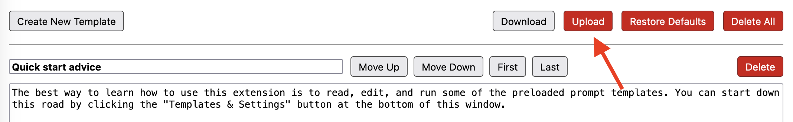

# Template Library

You can save and load collections of prompt templates on the LIT Prompts _Templates & Settings_ screen. Links to collections of templates can be found bellow. Please feel free to submit your own collections via _Pull requests_.

Template Collections: 

- [Default Templates](default_templates.txt). The templates that currently come preloaded with LIT Prompts.
